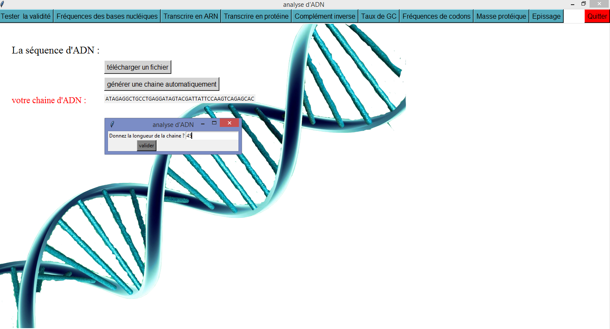

# Sequence-analysis
Une application pour automatiser le processus d’analyse d’une séquence ADN. Elle vise à traiter quelques prblèmes principaux de Rosalind problems .

## Exemples 

## Technologies
* Python
* Tkinter

## Fonctionnalités 
* Lire et traiter un fichier contenant les séquences d’ADN.
* Générer une chaîne ADN aléatoire d’une longueur donnée
* Vérifier la validité de la chaîne ADN si cette dernière est lue à partir d’un fichier. 
* Calculer les fréquences des bases nucléiques dans la chaîne ADN. 
* Transcrire la chaîne ADN en une chaîne ARN. 
* Transcrire la chaîne ARN résultante en protéines (i.e., acides aminés) 
* Calculer le complément inverse de la chaîne ADN. 
* Calculer le taux de GC de la séquence ADN. 
* Calculer les fréquences de codons dans la chaîne ADN. 
* Calculer la masse protéique. 
* Effectuer l'épissage d'ARN.  
* Sauvegarder les résultats obtenus dans un fichier.

## Requirments
